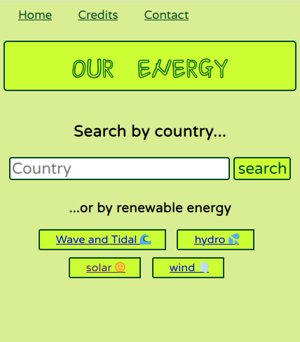

# :earth_africa: OurEnergy

*OurEnergy* is a web application to explore some meaningful data about the
[Global Power Plant Dataset](https://datasets.wri.org/dataset/globalpowerplantdatabase). You can explore either how each country is producing
energy or little charts comparing the top 5 countries that are distinguishing for
producing green energy :seedling:

[Live Demo](https://secure-castle-44065.herokuapp.com/)



## :wrench: Tech Stack
- Python Flask
- MongoDB Atlas
- Heroku

# :electric_plug: Run Locally

## Preparation of the dataset on MongoDB

Environment variables:
```bash
export MONGODB_URI='<your connection string to MongoDB'
export GPPDB_PATH='path/to/dataset/csvfile' # Do not write the extension '.csv'
```

For example my `GPPDB_PATH` env variable for the file `./data/global_power_plant_database.csv` is:
```bash
export GPPDB_PATH='./data/global_power_plant_database'
```

Finally you can run two scripts to convert the dataset to JSON and to upload
it to MongoDB Atlas:
```bash
python db_preparation/convert.py
python db_preparation/upload.py --cloud
```

## Run Flask app
```
FLASK_ENV=development FLASK_DEBUG=true FLASK_APP=app flask run
```

## Deploy to production

Create a `.env` file with the following variables:
```bash
export MONGODB_URI='<your mongo uri>'
export SECRET_KEY='<your secret key>'
```

You can generate a secret key using python:
```bash
python -c 'import secrets; print(secrets.token_hex())'

'<your secret key>'
```

Use **waitress** as production server:
```bash
waitress-serve --call 'app:create_app'
```